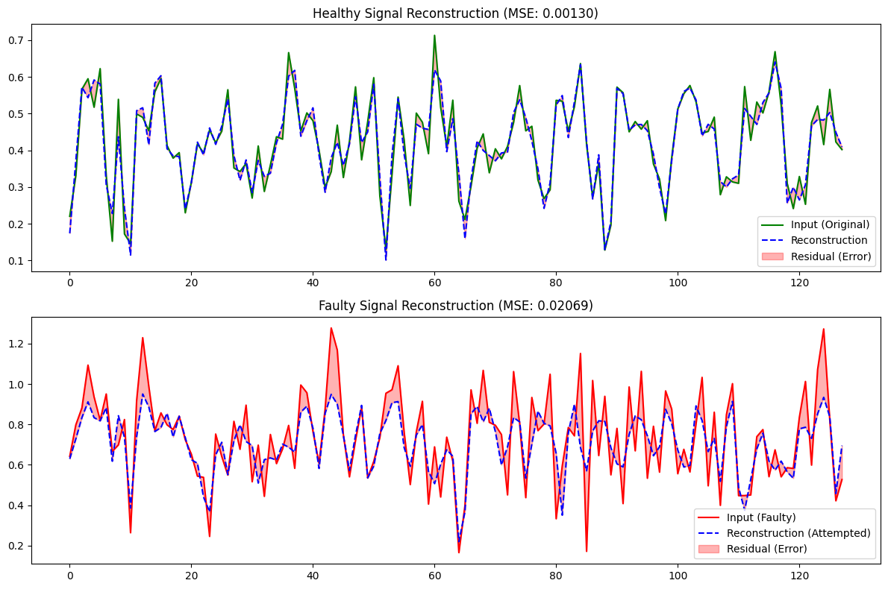
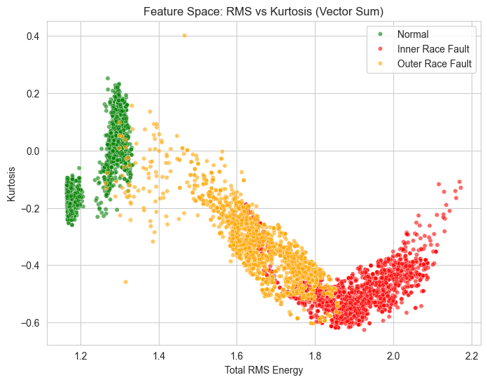
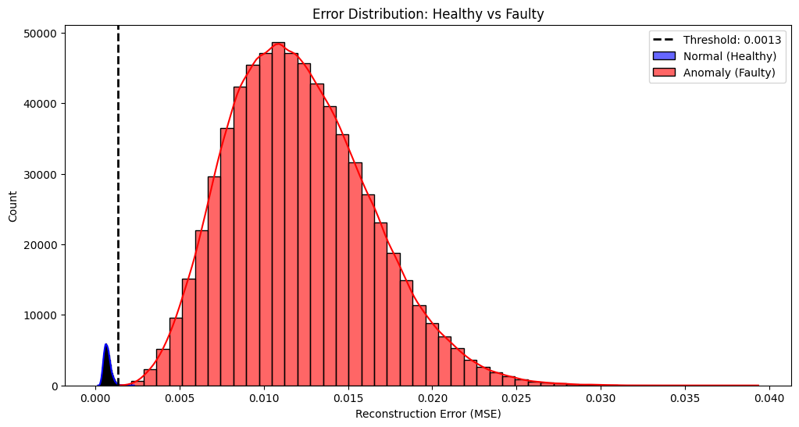
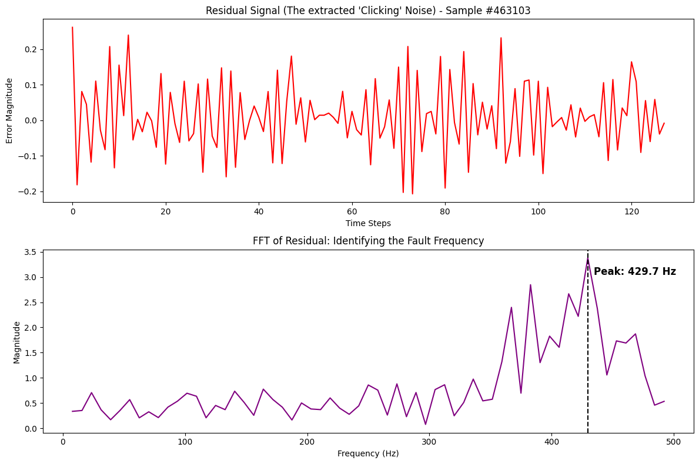

# ⚙️ Bearing Anomaly Detection (Digital Twin Prototype)

  

An unsupervised deep learning pipeline for detecting and diagnosing mechanical faults in rotating machinery. This branch focuses on **simulation and model validation** using the SUBFv1 dataset.

> **Note:** This branch contains the software simulation only. Hardware deployment (Arduino Uno Q) is currently being developed on the `arduino` branch.

## 🔍 Overview
This project implements a **1D Convolutional Autoencoder** to act as a "Digital Twin" of a healthy motor. The model learns the vibration signature of a *healthy* machine and flags deviations as anomalies.


*Above: The model reconstructs healthy signals perfectly (Top), but fails to reconstruct faulty spikes, leaving a large residual error (Bottom).*

## 📊 Key Results

### 1. Data Separation (EDA)
Before deep learning, we validated that statistical features could separate the classes. The **Vector Sum** magnitude allows us to visualize distinct clusters for healthy vs. faulty states.


### 2. Anomaly Detection (Thresholding)
Using a **3-Sigma** statistical cutoff on the Mean Squared Error (MSE), we achieved near-perfect separation between the healthy baseline and bearing faults.


### 3. Fault Diagnosis (Physics-Informed)
The Autoencoder detects *that* something is wrong; Physics tells us *what* is wrong. By performing an FFT on the residual signal (Input - Output), we can recover the characteristic fault frequency (BPFI/BPFO) without needing labeled training data.


## 📂 Project Structure
The pipeline is broken down into modular Jupyter notebooks for reproducibility:

| File | Description |
| :--- | :--- |
| `00_eda.ipynb` | Exploratory Data Analysis. Validated that **RMS (Energy)** and **Kurtosis (Spikiness)** can statistically separate healthy vs. faulty signals. |
| `01_data_preprocessing.ipynb` | Converts raw CSVs into tensors. Implements **Vector Summation** ($\sqrt{x^2+y^2+z^2}$) for rotation invariance, sliding window segmentation (128 samples), and chronological train/test splitting. |
| `02_model_training.ipynb` | Builds and trains the **1D Conv Autoencoder**. Uses purely healthy data for training (Self-Supervised). |
| `03_anomaly_testing.ipynb` | Validation logic. Establishes the anomaly threshold ($\mu + 3\sigma$) and performs **Physics-Informed Diagnosis** (FFT on residuals) to classify fault types. |
| `processed_data/` | Stores the serialized tensors (`.npy`) and the fitted `MinMaxScaler` for consistent inference. |
| `models/` | Contains the trained model weights (`autoencoder_v1.h5`). |

## 🧠 Model Architecture
* **Input:** 128-point vibration window (Vector Sum Magnitude).
* **Encoder:** 3-layer 1D Convolution (compresses signal to latent space).
* **Bottleneck:** Forces the model to learn the "shape" of healthy vibration, stripping out noise.
* **Decoder:** 3-layer Transposed Convolution (reconstructs the signal).
* **Loss Function:** Mean Squared Error (MSE).

## 🚀 Usage

1.  **Install Dependencies**
    ```bash
    pip install -r requirements.txt
    ```

2.  **Download Dataset**
    Run the helper script to fetch the SUBFv1 dataset:
    ```bash
    python download_SUBFv1.py
    ```

3.  **Run Pipeline**
    Execute the notebooks in order:
    1.  `01_data_preprocessing.ipynb`
    2.  `02_model_training.ipynb`
    3.  `03_anomaly_testing.ipynb`

## 🔜 Future Roadmap
* **Hardware Integration:** Porting the inference logic to **Arduino Uno Q**.
* **Real-world Validation:** Testing on a variable-speed table fan setup.
* **Live Dashboard:** Real-time plotting of residuals via Serial communication.